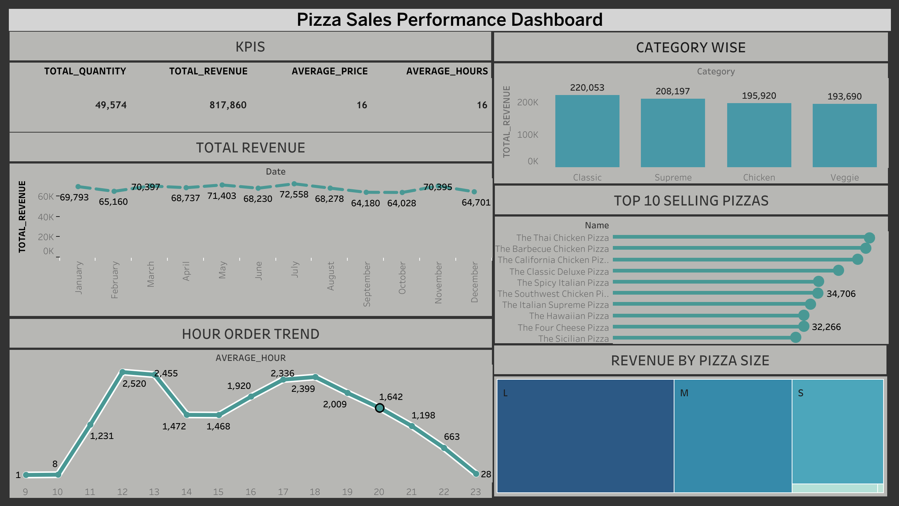

# 🍕 Pizza Sales Analysis Dashboard

## 📌 Project Overview
This project analyzes pizza sales data using SQL and Tableau Public to uncover business insights and visualize sales performance through an interactive dashboard.

## 🛠️ Tools Used
- SQL
- PostgreSQL
- Tableau Public

## 📊 Dashboard Features
- Total Revenue KPI
- Total Orders
- Total Quantity Sold
- Average Price
- Monthly Revenue Trend
- Hourly Order Trend
- Revenue by Pizza Category
- Revenue by Pizza Size
- Top 10 Selling Pizzas

## 📈 SQL Analysis
The following business questions were solved using SQL:
- Total Revenue
- Top Selling Pizzas
- Revenue by Category
- Revenue by Pizza Size
- Monthly Sales Trend
- Peak Ordering Hours
- Order Distribution

## 🖼️ Dashboard Preview

## 📂 Repository Contents
- SQLFULL_QUERY.sql
- Pizza_Sales_Dashboard.twbx
- dashboard.png

## 📧 Author
**Shivani Kuntal**
